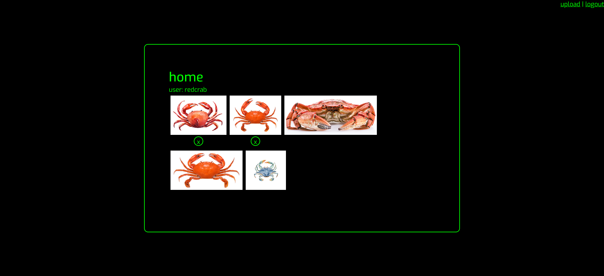
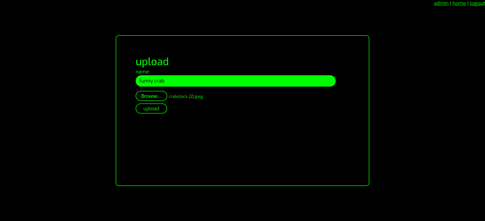
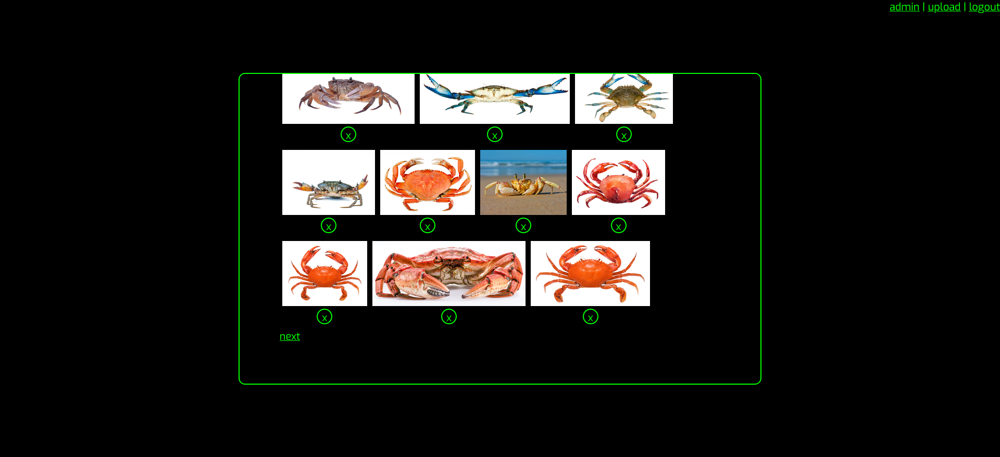
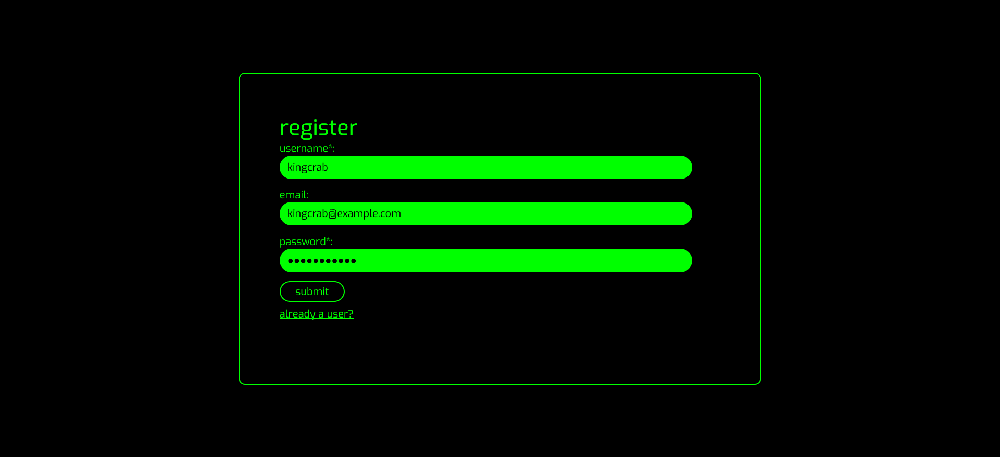
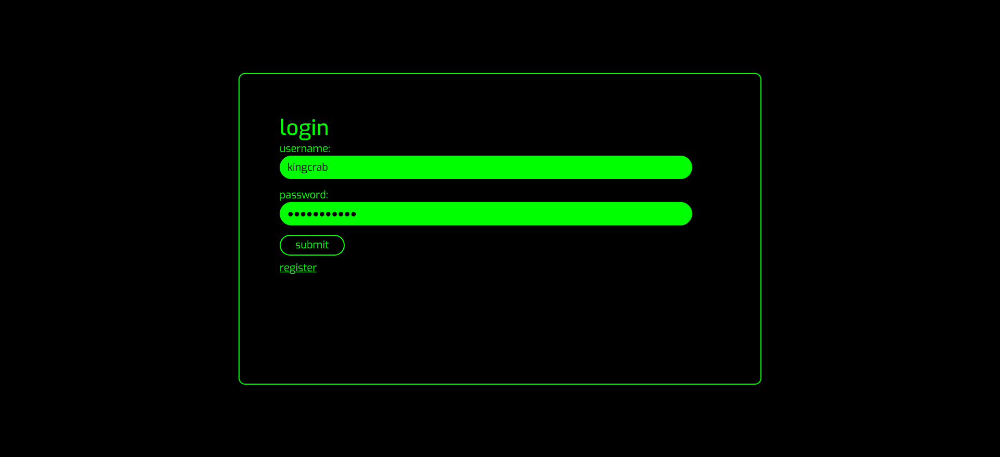
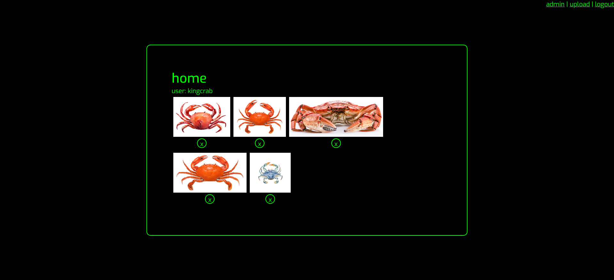
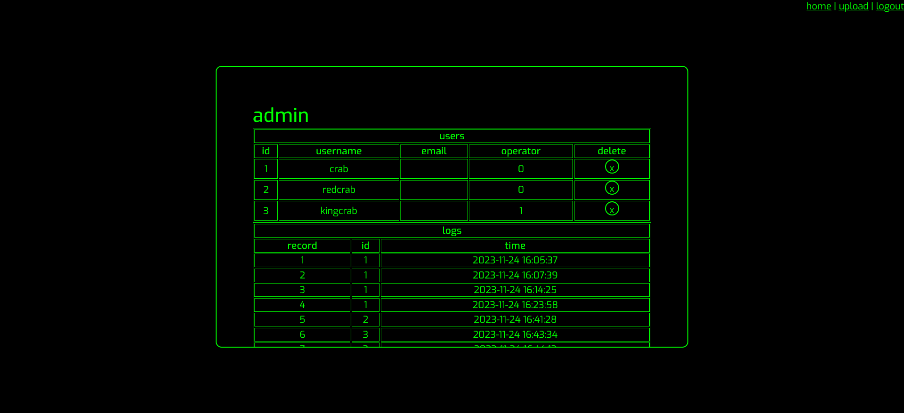

# Digital Gallery
This is a gallery that can only be accessed by registered users. All images are hashed on the server so only those with the direct link to the image will be able to access the image.

## Preview

It contains a home page displaying the 10 most recent images uploaded by users.

Users may upload and delete their own images.

Users may register and log into the website. All passwords are hashed in the database.

Admins can delete any image submitted by users. They may also delete users and view the login history.

## Purpose
This was made as part of a class project to use PHP and SQL to create a website with a login page, registration page, and additional content.